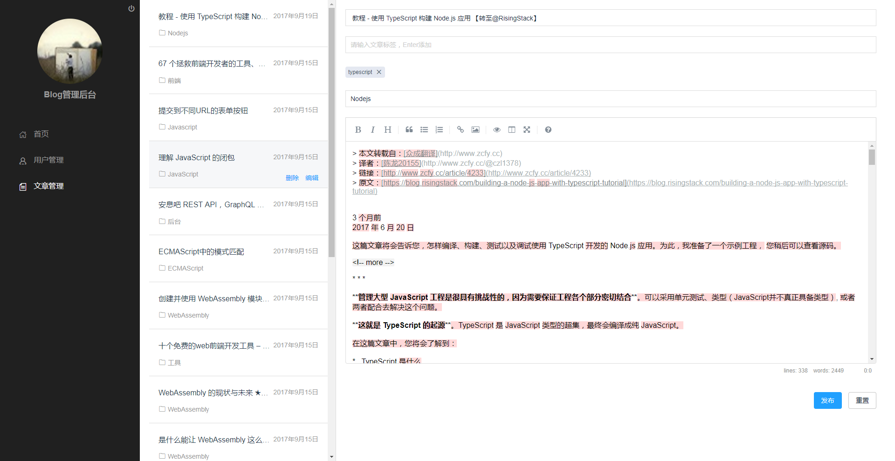

# node-koa-app

基于Koa2的Node app,该仓库旨在学习熟悉Koa2的用法，目的是达成一个前后端分离，首页采用服务端渲染的blog app。

## 用到的技术栈

- vue全家桶+webpack
- Koa2
- mongodb
- axios用于前后端的请求
- nodemon用于监听后端代码的改变
- mongoose用于连接mongoodb以及后续服务
- marked.js用于解析markdown格式的文本
- jsonwebtoken用于前后端鉴权

## 前端控制台页面



## 前端Blog页面


## 目标分步

- [x] 使用Koa跑起来一个简单的服务
- [x] 构建前端工程，添加到项目中
- [x] 前端可以通过restful api的方式调用后端的服务
- [x] 连接mongodb实现基础的增删改查
- [x] 详细阅读mongoose文档，搞清楚查询、更新、创建、删除等api的使用
- [x] blog页面与admin页面
- [x] 文章添加阅读次数统计
- [x] blog首页添加滚动加载
- [x] blog首页文章接口添加分页
- [x] 前端采用html5 history模式的路由
- [x] 文章页添加代码高亮
- [x] 文章的管理,初期想法想做一个和有道云笔记类似的文章管理界面
- [x] admin添加用户登录验证
- [ ] blog首页添加vue服务端渲染
- [ ] 调研如何线上部署的相关知识

## 如何使用

一、启动mongodb的服务

确保本机安装了mongoodb，在安装好的前提下，启动mongodb，如我的是这样启动的：

```
./bin/mongod --dbpath data/db
```

二、启动server端的服务

server文件夹下对应了服务端的代码，在根目录输入：

```
npm start
```
即可启动。代码中使用了nodemon监听代码的改动并实时更新

三、启动前端的dev-server

client文件夹下对应了客户端的代码，前后端分离模式下，前端开启自己的dev-server

```
npm run dev
```
